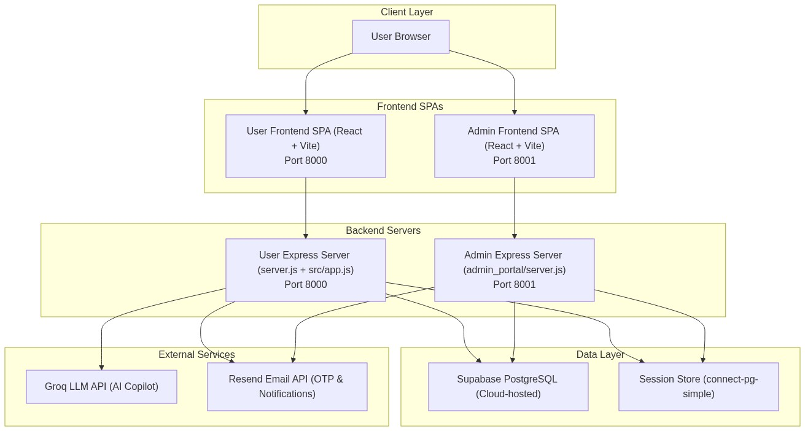
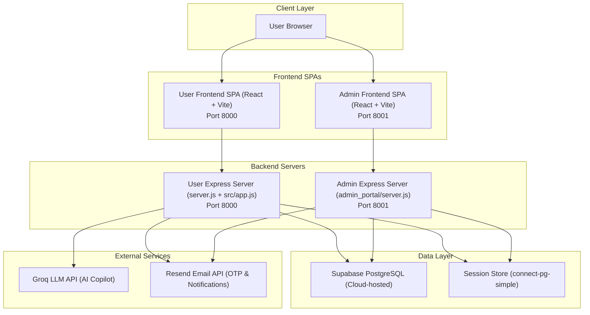
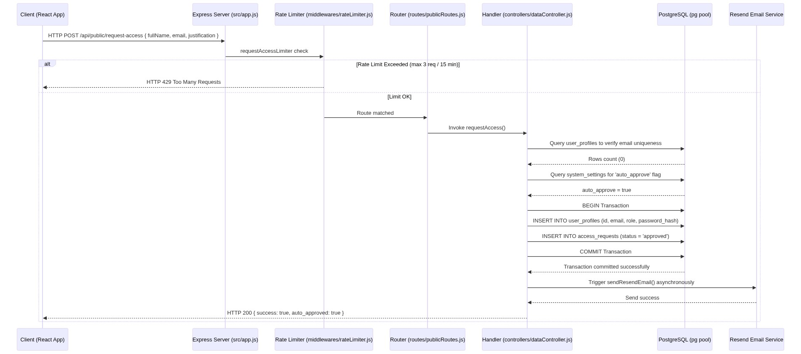
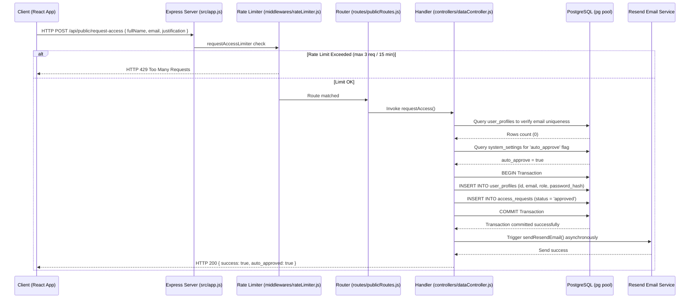
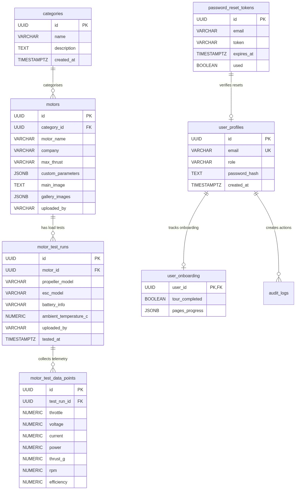
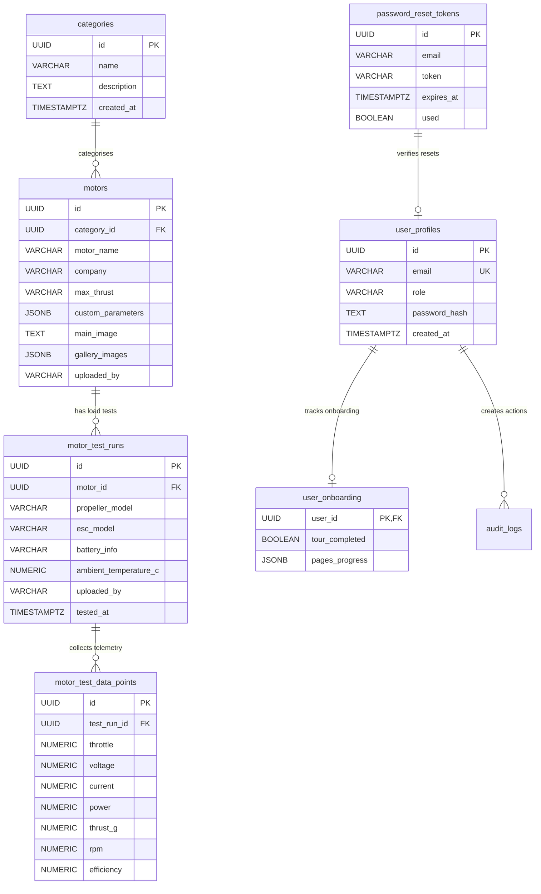

# ThrustVault — Application Architecture & Technical Documentation

> **Version**: 2.1.0 · **Platform**: UAV Propulsion Intelligence Database  
> **Domain**: [thrustvault.bharani-01.xyz](https://thrustvault.bharani-01.xyz)

---

## Table of Contents
1. [Project Overview](#1-project-overview)
2. [System Architecture](#2-system-architecture)
3. [Folder & File Structure](#3-folder--file-structure)
4. [Database Structure](#4-database-structure)
5. [API Documentation](#5-api-documentation)
6. [Core Business Logic](#6-core-business-logic)
7. [Frontend Structure](#7-frontend-structure)
8. [Configuration & Environment](#8-configuration--environment)
9. [Dependencies](#9-dependencies)
10. [Build, Run & Deploy](#10-build-run--deploy)
11. [Security Model & Surface Analysis](#11-security-model--surface-analysis)
12. [Monitoring & Observability](#12-monitoring--observability)
13. [Technical Debt & Actionable Backlog](#13-technical-debt--actionable-backlog)
14. [Glossary](#14-glossary)
15. [Changelog](#15-changelog)

---

## 1. Project Overview

ThrustVault is a **full-stack UAV propulsion intelligence platform** that consolidates motor specifications, ESC (Electronic Speed Controller) ratings, propeller performance data, and battery load test results into a unified engineering database. It is designed for drone engineers, UAV designers, and R&D teams who need to compare propulsion components, analyze thrust curves, and find optimal motor-ESC-propeller combinations.

### Target Users & Use Cases
- **UAV Propulsion Engineers**: Researching stator class sizing and KV ratings to match with appropriate propeller sizes.
- **Test Bench Operators**: Conducting load tests and uploading raw sensor telemetry (throttle, voltage, current, RPM, and thrust) to visualize efficiency curves.
- **R&D Managers**: Reviewing historical powertrain setups, bulk importing datasets from excel sheets, and customising specifications schema dynamic parameters.

### Tech Stack Summary
- **Languages**: JavaScript (Node.js ES6 backend), TypeScript (React frontend), and SQL (PostgreSQL relational dialect).
- **Backend Framework**: Express.js `^4.19.2` (routing, session handling, rate-limiting proxy).
- **Frontend Framework**: React `^19.2.7`, Vite `^8.1.1`, TailwindCSS `^4.3.2`, TypeScript `~6.0.2`, Chart.js `^4.5.1`.
- **Database**: Supabase Cloud-hosted PostgreSQL (tables, GIN indexes, RLS security policies, and custom plpgsql triggers).
- **Major Libraries**:
  - `pg` `^8.12.0` (Client connection pool & query executor)
  - `bcryptjs` `^2.4.3` / `^3.0.3` (Security hashing)
  - `connect-pg-simple` `^9.0.1` (Persistent sessions storage)
  - `xlsx` `^0.18.5` (SheetJS client-side Excel parse)
  - `lucide-react` `^1.23.0` (Technical SVG icons)

### Project Type
This is a **monorepo** consisting of two standalone server instances, each hosting its own compiled React Single Page Application (SPA).

- **User Portal Backend**: Located at root ([server.js](server.js) -> [src/app.js](src/app.js)). Serves the main React application on port `8000`.
- **User Portal Frontend**: Located in [frontend](frontend). React Vite SPA containing user search tools, analytics graphs, and recommendations.
- **Admin Portal**: Located in [admin_portal](admin_portal). Standalone portal on port `8001` containing administrative controls, user CRUD, audit logs, schema customization, and import/export managers.
- **Database Schema**: Located in [database](database). Includes DDL creation scripts and incremental sql migration files.
- **Legacy Fallback**: Located in [public](public). Legacy static HTML/JS files used as a fallback if the Vite React frontend dist bundle is not compiled.
- **Utilities & Diagnostics**: Located in [scratch](scratch). Scripts for database seeding, API testing, cache profiling, and role migration.

---

## 2. System Architecture

### High-Level Architecture Style
ThrustVault uses a **Dual Client-Server SPA Architecture** powered by a shared PostgreSQL database. Both portals connect to the same PostgreSQL server but listen on different ports, enforcing role isolation at the network boundary.

#### System Components Map


<details>
<summary>Show Mermaid Source</summary>


</details>

### Request Lifecycle
Below is the request lifecycle diagram for the `POST /api/public/request-access` route:



<details>
<summary>Show Mermaid Source</summary>


</details>

---

## 3. Folder & File Structure

### Directory Tree (Max 3 Levels Deep)
```
d:/motor data/
├── admin_portal/                  # Standalone Administrator Portal server
│   ├── frontend/                  # React admin client app
│   │   ├── dist/                  # Compiled admin client distribution
│   │   ├── public/                # Static public assets
│   │   └── src/                   # Source files (components, contexts, pages)
│   ├── src/                       # Configuration, routing, and utilities helper stubs
│   ├── package.json               # Admin Portal dependencies
│   ├── render.yaml                # Admin Portal deployment manifest
│   └── server.js                  # Standalone admin Express server configuration
│
├── database/                      # Relational schema DDL files and sql migrations
│   ├── audit_schema.sql           # Schema for audit logs
│   ├── schema.sql                 # Primary schema and initial structures
│   └── *.sql                      # Incremental migrations (access requests, drafts, etc.)
│
├── frontend/                      # User Dashboard Client Portal
│   ├── dist/                      # Compiled user client distribution
│   ├── public/                    # Static favicon and assets
│   ├── src/                       # React TypeScript code hierarchy
│   │   ├── components/            # Reusable UI widgets (Layout, CompareShelf)
│   │   ├── context/               # Global React contexts (Auth, Theme, Compare)
│   │   └── pages/                 # Full screen view components
│   └── package.json               # React dependencies
│
├── public/                        # Legacy fallback static views (HTML / JS / CSS)
│
├── src/                           # Backend routing and controllers for User Portal
│   ├── config/                    # PostgreSQL connection pools
│   ├── controllers/               # Business handlers (auth, telemetry data, AI)
│   ├── middlewares/               # Session checks and rate limit constraints
│   ├── routes/                    # Route routers mounting
│   └── utils/                     # Dynamic SQL query builders and helpers
│
├── .env                           # Local environment credentials configuration
├── package.json                   # Root server dependency manifest
├── render.yaml                    # Main platform Render.com deployment blueprint
└── server.js                      # User Portal entry point
```

### Naming Conventions
- **Controllers & Routing Utilities**: camelCase filenames with suffix (e.g. `authController.js`, `apiRoutes.js`, `queryBuilder.js`).
- **Database Migrations**: Snake case with description prefix (e.g. `migration_drafts_table.sql`, `audit_schema.sql`).
- **Frontend SPA Components**: PascalCase for JSX/TSX elements and views (e.g. `Layout.tsx`, `ESCExplorer.tsx`, `PerformanceAnalytics.tsx`).

---

## 4. Database Structure

### Database Tables Schema
The tables below reflect the active schema defined in [database/schema.sql](database/schema.sql) and related migrations:

#### Table: `categories`
Stores UAV weight/thrust range classes.
- **Fields**:
  - `id` `UUID` (PRIMARY KEY, Default `gen_random_uuid()`)
  - `name` `VARCHAR(255)` (NOT NULL)
  - `description` `TEXT`
  - `created_at` `TIMESTAMPTZ` (NOT NULL, Default UTC `now()`)
  - `updated_at` `TIMESTAMPTZ` (NOT NULL, Default UTC `now()`)
- **Constraints**: `chk_category_name` (`CHECK (char_length(trim(name)) > 0)`)
- **Relationships**: One-to-Many with `motors`.

#### Table: `motors`
Main catalog table storing motor specs.
- **Fields**:
  - `id` `UUID` (PRIMARY KEY, Default `gen_random_uuid()`)
  - `category_id` `UUID` (FOREIGN KEY references `categories(id) ON DELETE CASCADE`)
  - `motor_name` `VARCHAR(255)` (NOT NULL)
  - `company` `VARCHAR(255)` (NOT NULL)
  - `max_thrust` `VARCHAR(100)` (NOT NULL)
  - `recommended_esc` `VARCHAR(255)`
  - `recommended_propeller` `VARCHAR(255)`
  - `link_motor` `TEXT`
  - `link_esc` `TEXT`
  - `link_propeller` `TEXT`
  - `custom_parameters` `JSONB` (Default `'{}'`)
  - `main_image` `TEXT`
  - `gallery_images` `JSONB` (Default `'[]'`)
  - `uploaded_by` `VARCHAR(255)`
  - `created_at` `TIMESTAMPTZ` (NOT NULL, Default UTC `now()`)
  - `updated_at` `TIMESTAMPTZ` (NOT NULL, Default UTC `now()`)
- **Constraints**:
  - `chk_motor_name` (`CHECK (char_length(trim(motor_name)) > 0)`)
  - `chk_company` (`CHECK (char_length(trim(company)) > 0)`)
  - `chk_max_thrust` (`CHECK (char_length(trim(max_thrust)) > 0)`)
  - `chk_link_motor` / `chk_link_esc` / `chk_link_propeller` (Must match regex `^https?://` or be null/empty)
- **Indexes**:
  - `idx_motors_category_id` B-tree on `category_id`
  - `idx_motors_company` B-tree on `company`
  - `idx_motors_name_search` GIN on `to_tsvector('english', motor_name)` (Full text search support)
- **Relationships**: Belongs to `categories`. One-to-Many with `motor_test_runs`.

#### Table: `escs`
Electronic Speed Controllers specifications.
- **Fields**:
  - `id` `UUID` (PRIMARY KEY, Default `gen_random_uuid()`)
  - `name` `VARCHAR(255)` (NOT NULL)
  - `brand` `VARCHAR(255)` (NOT NULL)
  - `price` `VARCHAR(100)`, `currency` `VARCHAR(50)`, `sku` `VARCHAR(255)`, `url` `TEXT`
  - `main_image` `TEXT`, `gallery_images` `JSONB`, `custom_parameters` `JSONB`
  - `created_at` `TIMESTAMPTZ`, `updated_at` `TIMESTAMPTZ`
- **Constraints**: Unique key `uq_esc_name_brand` on `(name, brand)`
- **Indexes**: `idx_escs_brand` B-tree on `brand`

#### Table: `propellers`
Propeller configurations.
- **Fields**:
  - `id` `UUID` (PRIMARY KEY, Default `gen_random_uuid()`)
  - `name` `VARCHAR(255)` (NOT NULL)
  - `brand` `VARCHAR(255)` (NOT NULL)
  - `price` `VARCHAR(100)`, `currency` `VARCHAR(50)`, `sku` `VARCHAR(255)`, `url` `TEXT`
  - `main_image` `TEXT`, `gallery_images` `JSONB`, `custom_parameters` `JSONB`
  - `created_at` `TIMESTAMPTZ`, `updated_at` `TIMESTAMPTZ`
- **Constraints**: Unique key `uq_prop_name_brand` on `(name, brand)`
- **Indexes**: `idx_propellers_brand` B-tree on `brand`

#### Table: `motor_test_runs`
Captures metadata of a specific load test run.
- **Fields**:
  - `id` `UUID` (PRIMARY KEY, Default `gen_random_uuid()`)
  - `motor_id` `UUID` (FOREIGN KEY references `motors(id) ON DELETE CASCADE` NOT NULL)
  - `propeller_model` `VARCHAR(255)` (NOT NULL)
  - `esc_model` `VARCHAR(255)`, `battery_info` `VARCHAR(255)`, `ambient_temperature_c` `NUMERIC`
  - `test_conducted_by` `VARCHAR(255)`, `uploaded_by` `VARCHAR(255)`, `extra_columns` `JSONB`
  - `tested_at` `TIMESTAMPTZ`, `created_at` `TIMESTAMPTZ`
- **Constraints**: `chk_propeller_model` (`CHECK (char_length(trim(propeller_model)) > 0)`)
- **Indexes**: `idx_motor_test_runs_motor_id` on `motor_id`
- **Relationships**: Belongs to `motors`. One-to-Many with `motor_test_data_points`.

#### Table: `motor_test_data_points`
Stores individual telemetry points measured along throttle progression curve.
- **Fields**:
  - `id` `UUID` (PRIMARY KEY)
  - `test_run_id` `UUID` (FOREIGN KEY references `motor_test_runs(id) ON DELETE CASCADE` NOT NULL)
  - `throttle` `NUMERIC`, `voltage` `NUMERIC`, `current` `NUMERIC`, `power` `NUMERIC`, `thrust_g` `NUMERIC`, `rpm` `NUMERIC`, `efficiency` `NUMERIC`, `temperature` `NUMERIC`, `extra_data` `JSONB`, `created_at` `TIMESTAMPTZ`
- **Constraints**: Validates ranges: `throttle` 0 to 100, others >= 0.
- **Indexes**: `idx_motor_test_data_points_run_id` on `test_run_id`
- **Relationships**: Belongs to `motor_test_runs`.

#### Table: `user_profiles`
Main identity mapping table.
- **Fields**:
  - `id` `UUID` (PRIMARY KEY, FOREIGN KEY references `auth.users(id) ON DELETE CASCADE`)
  - `email` `VARCHAR(255)` (UNIQUE NOT NULL)
  - `role` `VARCHAR(50)` (NOT NULL, CHECK (role IN ('guest', 'user', 'admin')))
  - `password_hash` `TEXT`
  - `created_at` `TIMESTAMPTZ`

#### Table: `access_requests`
Sign-up requests submitted by users.
- **Fields**:
  - `id` `UUID` (PRIMARY KEY)
  - `full_name` `VARCHAR(255)`, `email` `VARCHAR(255)` (UNIQUE NOT NULL)
  - `requested_role` `VARCHAR(50)` (CHECK IN ('guest', 'user', 'admin'))
  - `justification` `TEXT`
  - `status` `VARCHAR(50)` (Default `'pending'`, CHECK IN ('pending', 'approved', 'rejected'))
  - `created_at` `TIMESTAMPTZ`, `updated_at` `TIMESTAMPTZ`

#### Table: `audit_logs`
Database of system operations.
- **Fields**:
  - `id` `UUID` (PRIMARY KEY)
  - `timestamp` `TIMESTAMPTZ`, `email` `VARCHAR(255)`, `role` `VARCHAR(50)`, `route` `TEXT`, `method` `VARCHAR(10)`, `status` `INTEGER`, `ip_address` `VARCHAR(100)`, `user_agent` `TEXT`, `location` `VARCHAR(255)`, `risk_level` `VARCHAR(50)`, `details` `TEXT`
- **Indexes**: `idx_audit_logs_timestamp` (DESC), `idx_audit_logs_email`

### Database Entity-Relationship Diagram


<details>
<summary>Show Mermaid Source</summary>


</details>

- **ORM / ODM**: No ORM is used. The application constructs raw SQL queries dynamically using a generic query compiler layer (see [src/utils/queryBuilder.js](src/utils/queryBuilder.js)).
- **Database Migrations Strategy**: Manual deployment of schema migrations using localized DDL scripts executed inside the PostgreSQL client environment (schema and initial records are detailed in [database/schema.sql](database/schema.sql)).

---

## 5. API Documentation

### 5.1 Authentication Module (`/api/auth`)
Routes configured in [src/routes/authRoutes.js](src/routes/authRoutes.js):

| Method | Path | Auth Required | Request Body / Query Params | Response Success Shape (200 OK) | Error Codes & Cases |
|---|---|---|---|---|---|
| `POST` | `/api/auth/login` | No | `{ email, password }` | `{ email, role, uid, timestamp }` | `400` Missing credentials or invalid passwords |
| `POST` | `/api/auth/logout` | Yes | *None* | `{ success: true }` | `200` always returns success |
| `GET` | `/api/auth/session` | Yes | *None* | `{ logged_in: true, email, role, uid }` | Returns `{ logged_in: false }` if expired |
| `POST` | `/api/auth/forgot-password` | No | `{ email }` | `{ success: true }` | `500` Email send failures (Resend API errors) |
| `POST` | `/api/auth/verify-otp` | No | `{ email, token }` | `{ success: true }` | `400` If email/token format is missing |
| `POST` | `/api/auth/reset-password` | Yes (OTP Session validated) | `{ password }` | `{ success: true }` | `400` Expired reset session, password under 6 chars |

### 5.2 Catalog Telemetry Data Module (`/api`)
Routes configured in [src/routes/apiRoutes.js](src/routes/apiRoutes.js):

| Method | Path | Auth Required | Request Body / Query Params | Response Shape | Error Cases |
|---|---|---|---|---|---|
| `GET` | `/api/init-data` | Yes (`user`/`admin`) | *None* | `{ categories: [], totalMotors, totalEscs, firstMotors: [] }` | `401` Unauthorized session |
| `GET` | `/api/motors` | Yes (`user`/`admin`) | `?search=F80&limit=10` | `[{ id, motor_name, company, max_thrust }]` | `500` SQL execution fail |
| `POST` | `/api/motors` | Yes (`user`/`admin`) | Motor payload schema | `[{ id, motor_name, ... }]` | `403` Forbidden payload validation |
| `PATCH` | `/api/motors/:id/recommendations` | Yes (`user`/`admin`) | `{ recommended_esc, recommended_propeller }` | `[{ id, motor_name, ... }]` | `404` Motor ID not found |
| `GET` | `/api/categories` | Yes (`user`/`admin`) | *None* | `[{ id, name, description }]` | `500` DB error |
| `POST` | `/api/categories` | Yes (`user`/`admin`) | `{ name, description }` | `[{ id, name, ... }]` | `400` Blank category name |
| `DELETE` | `/api/categories/:id` | Yes (`user`/`admin`) | *None* | Deleted category row details | `404` Not found |
| `GET` | `/api/escs` | Yes (`user`/`admin`) | *None* | `[{ id, name, brand, custom_parameters }]` | `500` Connection timeout |
| `POST` | `/api/escs` | Yes (`user`/`admin`) | ESC parameters | `[{ id, name, ... }]` | `409` Unique key conflict |
| `GET` | `/api/propellers` | Yes (`user`/`admin`) | *None* | `[{ id, name, brand, custom_parameters }]` | `500` DB error |
| `POST` | `/api/propellers` | Yes (`user`/`admin`) | Propeller parameters | `[{ id, name, ... }]` | `409` Unique key conflict |
| `GET` | `/api/custom-specs` | Yes (`user`/`admin`) | *None* | `[{ id, field_key, field_name }]` | `500` DB error |
| `POST` | `/api/custom-specs` | Yes (`user`/`admin`) | `{ field_key, field_name, field_type }` | `[{ id, field_key, ... }]` | `400` Unsafe SQL field validation |

### 5.3 Generic Query Database Proxy Endpoint (`/api/db/:table`)
Maps query requests to standard tables with internal ACL check (see [src/routes/proxyRoutes.js](src/routes/proxyRoutes.js#L17)):

| Method | Path | Auth Required | Description |
|---|---|---|---|
| `ALL` | `/api/db/:table` | Yes (ACL check) | Maps select, insert, update, or delete payloads directly to the specified database table. |
| `ALL` | `/api/db/:table/:id` | Yes (ACL check) | Proxies requests for a specific table row filtering by ID. |

### 5.4 Guest & Public APIs (No Session Auth Required)
Routes configured in [src/routes/guestRoutes.js](src/routes/guestRoutes.js) and [src/routes/publicRoutes.js](src/routes/publicRoutes.js):

| Method | Path | Rate Limit | Purpose |
|---|---|---|---|
| `POST` | `/api/public/request-access` | Consolidated (see Security) | Registration request endpoint (supports auto-approval check). |
| `GET` | `/api/public/find-item/:name` | None | Looks up motor, ESC, or propeller details matching the exact name. |
| `POST` | `/api/ai/chat` | Consolidated (see Security) | AI Copilot Chat Endpoint (Groq interface). |
| `GET` | `/api/guest/share/:type/:name` | Consolidated (see Security) | Fetch public specs sheet layout for a shared motor/ESC/propeller. |
| `GET` | `/api/guest/motors/search` | Consolidated (see Security) | Unauthenticated motor search catalog endpoint. |

### 5.5 Admin Core APIs (`/api/admin/*`)
Configured directly inside standalone [admin_portal/server.js](admin_portal/server.js):

| Method | Path | Auth Required | Description |
|---|---|---|---|
| `GET` | `/api/admin/settings` | Yes (`admin`) | Fetch global configuration overrides (e.g., `auto_approve` toggle). |
| `POST` | `/api/admin/settings` | Yes (`admin`) | Save settings. |
| `POST` | `/api/admin/rpc/create_vault_user` | Yes (`admin`) | Triggers secure database RPC function to insert accounts into `auth.users` schema. |
| `POST` | `/api/admin/rpc/delete_vault_user` | Yes (`admin`) | Deletes account profiles and cascades deletions to the auth schema. |
| `GET` | `/api/audit-logs` | Yes (`admin`) | Retrieve administrative activity tracking table. |
| `GET` | `/api/admin/statistics` | Yes (`admin`) | Fetch platform counts dashboard analytics. |
| `PATCH` | `/api/admin/users/:id` | Yes (`admin`) | Enable/disable or alter roles of user accounts. |

*Reconciliation*: ThrustVault does not ship with an active OpenAPI/Swagger document configuration stub. No active schema mismatches exist, as API definition is code-first and dynamic.

---

## 6. Core Business Logic

### Motor Recommendation Filtering Algorithm
The "Motor Finder Wizard" uses a database-driven filter query inside [src/controllers/dataController.js](src/controllers/dataController.js#L860) to evaluate suitable candidates matching the requested operating specifications:

1. **Stator Class Classification**:
   The stator class is parsed from the first two digits of the stator size string (or motor name) (see [src/controllers/dataController.js](src/controllers/dataController.js#L952)):
   - **Micro**: Diameter $< 14$ mm (e.g. 1106)
   - **Mini**: $14$ mm $\le$ Diameter $< 22$ mm (e.g. 1507)
   - **Standard**: $22$ mm $\le$ Diameter $\le 25$ mm (e.g. 2207, 2306)
   - **Heavy**: Diameter $\ge 26$ mm (e.g. 2807, 3110)
2. **Thrust Unit Standardisation**:
   Motors store max thrust in various units (g, kg, lbs, N). The query standardises these into **kilograms (kg)** for comparative analysis:
   - Grams (`g`): $\text{value} / 1000$
   - Newtons (`N`): $\text{value} / 9.80665$
   - Pounds (`lb`): $\text{value} \times 0.453592$
3. **Voltage Cell Estimation**:
   Operating battery ranges are stored as text strings (e.g., "4-6S" or "12S"). The finder uses regex parsing to evaluate compatibility with user battery inputs:
   ```javascript
   const regexPattern = cellArray.map(c => `${c}s`).join('|');
   whereParts.push(`(custom_parameters->>'operating_voltage' ~* $${vals.length})`);
   ```

### AI Copilot Multi-Phase Search & Response
The AI Copilot uses a two-phase architecture to query and present data (see [src/controllers/aiController.js](src/controllers/aiController.js#L293)):
- **Phase 1 (Intent Extraction)**: Parses the user's natural query into structured JSON query parameters using a low-temperature Groq LLM call.
- **Phase 2 (Context Augmentation)**: Executes a PostgreSQL search based on the extracted JSON. If no matches are found, it sequentially relaxes constraints (e.g., dropping the category name or brand constraint).
- **Phase 3 (Structured Output)**: Injects the matching records as context. The LLM must explicitly tag specs as **`[Database Verified]`** (taken directly from the context) or **`[Engineering Suggestion]`** (calculated estimates) and append action URIs (e.g., `thrustvault://open-motor?id=MOTOR_ID`) to link back to the catalog UI.

---

## 7. Frontend Structure

ThrustVault implements two independent SPA clients using Vite + React.

### Component & Routing Hierarchy

#### User Portal SPA ([frontend/src/App.tsx](frontend/src/App.tsx))
- **`Layout` Wrapper**: Implements the main navbar, theme toggle, and keyboard-navigable search bar.
  - `/` -> `Landing`: Marketing landing page.
  - `/login` -> `Login`: Multi-view authentication component.
  - `/request_access` -> `RequestAccess`: Sign-up access justification form.
  - `/dashboard` -> `Dashboard` *(Protected)*: Main catalog. Displays motor cards by category, custom spec attributes, and a slide-out comparison drawer.
  - `/escs` -> `ESCExplorer` *(Protected)*: Sortable grid catalog.
  - `/propellers` -> `PropellerExplorer` *(Protected)*: Parametric grid catalog.
  - `/analytics` -> `PerformanceAnalytics` *(Protected)*: Selects load test runs and renders RPM/current/power vs throttle charts using Chart.js.
  - `/finder` -> `MotorFinder` *(Protected)*: AI recommendation chat panel.
  - `/share/:type/:name` -> `Share`: Public sharing specs view.
  - `/motor/:name` -> `ItemProfile` *(Protected)*: Detailed motor profile page.

#### Admin Portal SPA ([admin_portal/frontend/src/App.tsx](admin_portal/frontend/src/App.tsx))
- **`AdminRoute` Wrapper**: Limits layout access to users with `session.role === 'admin'`.
  - `/admin/dashboard` -> `Dashboard`: Motor catalog with inline edit, create, and delete actions.
  - `/admin/escs` -> `ESCExplorer`: Sortable grid catalog.
  - `/admin/propellers` -> `PropellerExplorer`: Parametric grid catalog.
  - `/admin/analytics` -> `PerformanceAnalytics`: Selects load test runs and renders RPM/current/power vs throttle charts.
  - `/admin/users` -> `AdminUsers`: Add, suspend, or modify platform user profiles.
  - `/admin/access-requests` -> `AdminAccessRequests`: Administrative request approvals.
  - `/admin/schema-customizer` -> `AdminSchemaCustomizer`: Create or delete custom spec columns.
  - `/admin/audit-logs` -> `AdminAuditLogs`: Activity logs viewer with risk warning filters.
  - `/admin/imports` -> `AdminImports`: Telemetry upload wizard using SheetJS.
  - `/admin/exports` -> `AdminExports`: Raw database tables exporter (JSON/CSV).

### State Management
- **`AuthContext`** ([frontend/src/context/AuthContext.tsx](frontend/src/context/AuthContext.tsx)): Tracks authentication state, user metadata, and session tokens. Persists the session in `localStorage` under `thrustvault_session` and clears backend cookies on logout.
- **`ThemeContext`**: Stores the selected theme class (`light` or `dark`) in `localStorage` and appends it to the DOM root element.
- **`CompareContext`**: Manages the comparison shelf, permitting up to 4 motors to be selected for side-by-side spec evaluation.

---

## 8. Configuration & Environment

Configuration keys are defined in `.env` files and loaded via `dotenv`. The table below lists all parameters used across the servers:

| Variable Name | Purpose | Required | Controlled Behavior |
|---|---|---|---|
| `DB_HOST` | Supabase Postgres DB host URL | **Yes** | Host address of cloud-hosted PostgreSQL database. |
| `DB_PORT` | DB connection port | No | Default: `5432` |
| `DB_USER` | DB auth user username | No | Default: `postgres` |
| `DB_PASSWORD` | DB user password | **Yes** | Database password. |
| `DB_NAME` | Connection database name | No | Default: `postgres` |
| `PORT` | User Portal backend port | No | Default: `8000` |
| `ADMIN_PORT` | Admin Portal backend port | No | Default: `8001` |
| `SESSION_SECRET` | Express session encryption key | **Yes** | Key used by `express-session` to encrypt session IDs in cookies. |
| `RESEND_API_KEY` | Resend API Authorization | **Yes** | Bearer token for sending password reset and registration emails. |
| `GROQ_API_KEY` | Groq LLM authentication key | **Yes** | API key used by the AI Copilot to call Groq. |
| `GROQ_MODEL` | Groq chat completion model | No | Model name (Default: `llama-3.3-70b-versatile`). |
| `APP_BASE_URL` | User Portal base URL | No | App base URL used in generated links. Default: `https://thrustvault.bharani-01.xyz`. |
| `NODE_ENV` | Runtime environment mode | No | Enforces secure cookie attributes when set to `production`. |
| `auditlog` | Audit logs toggle | No | Enables/disables security activity logging in database. Default: `false`. |

---

## 9. Dependencies

The table below outlines the core dependencies used in the project and their purpose:

| Dependency | Scope | Crucial Role in Application |
|---|---|---|
| `express` | Backend (Both) | Routing and middleware pipeline for the API servers. |
| `pg` | Backend (Both) | PostgreSQL client connection pool to execute database queries. |
| `connect-pg-simple` | Backend (Both) | Persists Express sessions in the database (`user_sessions` table) to maintain logins. |
| `bcryptjs` | Backend (Both) | Securely hashes passwords using bcrypt before saving to `user_profiles`. |
| `express-rate-limit` | User Backend | Limits brute-force login attempts, AI requests, and spam registration requests. |
| `@aws-sdk/...cognito...` | Admin Backend | **Legacy Dependency**: Remaining AWS Cognito SDK wrapper (marked as deprecated). |
| `react` / `react-dom` | Frontend (Both) | Renders the single page application interfaces. |
| `react-router-dom` | Frontend (Both) | Client-side routing. |
| `chart.js` / `react-chartjs-2`| Frontend (Both) | Renders line charts for load test curves. |
| `xlsx` | Frontend (Both) | Parse uploaded Excel/CSV test logs into database JSON payloads. |
| `sharp` | Root Dev | Image processing library for uploading and resizing static assets. |

---

## 10. Build, Run & Deploy

### Installation
Install dependencies in the root directory and child folders:
```bash
# Install root backend dependencies
npm install

# Install user frontend SPA dependencies
cd frontend && npm install

# Install admin backend and frontend dependencies
cd ../admin_portal && npm install
cd frontend && npm install
```

### Local Development
To launch the dev servers locally:
```bash
# Run User Portal backend server (watches server.js on port 8000)
npm run dev

# Run User Portal Vite client (port 5173 by default)
cd frontend && npm run dev

# Run Admin Portal backend server (watches server.js on port 8001)
cd admin_portal && npm start

# Run Admin Portal Vite client
cd admin_portal/frontend && npm run dev
```

### Running Tests
There is no automated unit testing pipeline (such as Jest or Mocha) configured in `package.json`. 
Verification is performed using manual diagnostics and API scripts inside the `scratch/` directory:
```bash
# Example: Verify API endpoint routes response status codes
node scratch/test_endpoints.js

# Example: Validate user login API session creation
node scratch/test_login_api.js
```

### Build & Deploy
1. **Frontend Production Build**:
   ```bash
   # Build User Client SPA (Outputs bundle to frontend/dist)
   cd frontend && npm run build

   # Build Admin Client SPA (Outputs bundle to admin_portal/frontend/dist)
   cd admin_portal/frontend && npm run build
   ```
2. **Static Fallback Routing**:
   Both servers check for the existence of `dist/index.html` at startup. If found, they serve the compiled React SPA. If missing, they fall back to rendering legacy HTML views from the root `/public` folder.
3. **Render.com Deployment**:
   Deployment is managed via Render.com using the `render.yaml` deployment blueprints in the root and admin portal directories. They deploy Node.js web services that install dependencies and run `npm start`.

---

## 11. Security Model & Surface Analysis

### SQL Injection Surface on Dynamic Query Builder
The application resolves dynamic tables and queries via the `dbProxy` controller (see [src/controllers/dataController.js](src/controllers/dataController.js#L571)) and standardizes filtering with `queryTable` (see [src/utils/queryBuilder.js](src/utils/queryBuilder.js#L35)):

- **Parameterization**: Values passed through query filters (e.g. `?brand=eq.KDE`) are safely extracted and passed as parameterized placeholders (`$1`, `$2`, etc.) to the database driver `pool.query(sql, vals)`.
- **Identifier Whitelisting**: Table and column names cannot be parameterized dynamically in PostgreSQL. To mitigate SQL injection, the query builder enforces a strict alphanumeric regular expression check:
  ```javascript
  const SAFE = /^[a-zA-Z0-9_]+$/;
  if (!SAFE.test(table)) throw new Error(`Unsafe table name: ${table}`);
  ```
  Any attempt to inject malicious SQL commands (such as semicolon operators or drop statements) in URL parameters is blocked by this constraint validation.

### Gitignored Secret Variables
To ensure environment variables and api credentials are not exposed to the public repository:
- The root [.gitignore](.gitignore#L1-L2) file explicitly includes `.env` and `**/.env` rules.
- Local configuration variables (Groq keys, Supabase Postgres passwords, and email credentials) remain fully isolated on local development nodes and host runtime dashboards.

### Password Reset Token Storage
The forgot-password reset flow issues temporary 6-digit verification codes:
- **Plaintext Vulnerability**: Generated OTP codes are stored in **plaintext** inside the `token` column of `public.password_reset_tokens` (see [src/controllers/authController.js](src/controllers/authController.js#L114)).
- **Mitigating Controls**: Tokens are constrained by an automatic expiration window of 10 minutes (`expires_at`), marked as `used = TRUE` immediately upon single-use validation, and pruned automatically on subsequent verification cycles. However, database compromise exposes pending OTPs.

### CORS & Origin Policies
- **Shared Origins**: In production environments, the frontend SPA and backend API are hosted on the same origin (same domain, same port). The backend serves compile files statically, eliminating the need for complex cross-origin resource sharing configuration.
- **Portals Isolation**: The User Portal (`localhost:8000`) and Admin Portal (`localhost:8001`) run on independent servers.
- **Cookie Sharing**: Express session cookies use standard configuration rules:
  ```javascript
  cookie: {
    secure: process.env.NODE_ENV === 'production',
    httpOnly: true,
    maxAge: 86400000, // 24 hours
    sameSite: 'lax'
  }
  ```
  The cookies share the same root domain. Because both portals check the active session against the `user_sessions` database table, they share login state if accessed on the same host root domain (e.g., localhost), but route access is restricted by strict role checks.

### Consolidated Rate Limiting Rules
The Express backend implements rate limiting on sensitive routes using the `express-rate-limit` middleware (see [src/middlewares/rateLimiter.js](src/middlewares/rateLimiter.js)):

| Rate Limiter | Window | Max Requests | Affected Endpoints | Response Action |
|---|---|---|---|---|
| `loginLimiter` | 1 minute | 5 | `POST /api/auth/login` | HTTP 429: "Too many login attempts..." |
| `requestAccessLimiter` | 15 minutes | 3 | `POST /api/public/request-access` | HTTP 429: "Too many requests. Please try again..." |
| `guestLimiter` | 1 minute | 60 | `POST /api/ai/chat`<br/>`GET /api/guest/*` | HTTP 429: "Too many requests. Please slow down." |

---

## 12. Monitoring & Observability

### Logging Framework
- **Standard Output (stdout/stderr)**: Standard runtime messages and error logs are captured via direct console statements (`console.log` / `console.error`) inside controllers and initialization bootstrapping blocks.
- **Database Auditing Logs**: When the `auditlog=true` environment flag is active, administrative actions are dynamically recorded in the `audit_logs` table (see [database/audit_schema.sql](database/audit_schema.sql)).

### APM, Errors & Performance Profiling
- **Application Performance Monitoring (APM)**: *Not found in codebase*. The project does not currently integrate error monitoring or APM SDK libraries (such as Sentry, LogRocket, Datadog, or NewRelic).

### Health Checks
- **Platform Health Endpoint**: *Not found in codebase*. Neither the user portal nor the admin portal backend hosts a dedicated health verification route (such as `/health` or `/status`). Server availability is checked implicitly via API route execution checks.

---

## 13. Technical Debt & Actionable Backlog

Below is the prioritized actionable backlog targeting technical debt items found across the ThrustVault repository:

| Backlog Item | Target Component / File | Priority | Est. Effort | Description & Action Plan |
|---|---|---|---|---|
| **Remove Legacy Cognito SDK** | `admin_portal/package.json`<br/>`src/config/cognito.js` | **Low** | 1–2 hours | Completely remove AWS Cognito provider client packages and clear deprecated configuration stubs from configuration scripts. |
| **Implement Password Hashing for Reset Tokens** | `src/controllers/authController.js`<br/>`database/migration_pg_auth.sql` | **Medium** | 3–4 hours | Update the password reset token schema to store hashed tokens (SHA-256 or bcrypt) in the database rather than plaintext. |
| **Split Monolithic Data Controller** | `src/controllers/dataController.js` | **Medium** | 1–2 days | Refactor the 1,000-line controller into separate domain modules (e.g. `telemetryController.js`, `accessController.js`, `importExportController.js`). |
| **Configure Distributed Cache Store** | `src/controllers/dataController.js` | **Medium** | 1 day | Replace the in-memory global variable `cachedDashboardStats` with a distributed cache store (e.g., Redis) to support multi-node scaling. |
| **Add Automated Test Suite** | Whole Codebase | **High** | Ongoing | Build integration and unit test runners (e.g. Mocha/Jest) to automate endpoints validation, replacing the manual verification scripts in `scratch/`. |

---

## 14. Glossary

- **Stator Size**: A 4-digit motor class rating (e.g., 2207). The first two digits indicate stator diameter (22mm), and the last two indicate stator height (7mm).
- **KV Rating**: The RPM constant of a motor. Indicates the number of revolutions per minute a motor spins per 1 volt of applied power with no load.
- **ESC**: Electronic Speed Controller. An electronic circuit that controls the speed of an electric motor.
- **Thrust Curve**: Graphical plot indicating the relation between throttle inputs (%) and output thrust (g or kg).
- **GIN Index**: Generalized Inverted Index. Used in PostgreSQL to accelerate full-text searches across text columns.
- **RLS**: Row Level Security. Database-level access control rules that restrict which rows are returned to a query based on the active database user role.
- **PostgREST Query Emulator**: A translation module ([src/utils/queryBuilder.js](src/utils/queryBuilder.js)) that parses URL query arguments into standard parameterized SQL syntax.

---

## 15. Changelog

Below is the version diff history detailing documentation updates:

| Version | Date | Key Changes & Added Content | Co-author |
|---|---|---|---|
| **v2.0.0** | July 06, 2026 | Initial full monorepo documentation structure covering architecture, directory structure, and databases. | AI Assistant |
| **v2.1.0** | July 07, 2026 | Pre-rendered Mermaid diagrams into PNGs, added dedicated Security & Observability sections, consolidated rate limits, and implemented relative link structures. | AI Assistant |

---
*Document compiled for ThrustVault v2.1.0 — July 2026*
