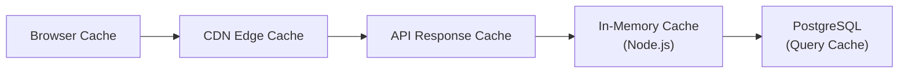

# ThrustVault — Performance Optimization Guide

> Actionable recommendations to improve application speed, reduce latency, and scale the platform.

---

## Table of Contents

1. [Current Performance Bottlenecks](#1-current-performance-bottlenecks)
2. [Database Optimizations](#2-database-optimizations)
3. [Backend / API Optimizations](#3-backend--api-optimizations)
4. [Frontend Optimizations](#4-frontend-optimizations)
5. [Caching Strategy](#5-caching-strategy)
6. [Network & Delivery Optimizations](#6-network--delivery-optimizations)
7. [Architecture-Level Improvements](#7-architecture-level-improvements)
8. [Priority Implementation Roadmap](#8-priority-implementation-roadmap)

---

## 1. Current Performance Bottlenecks

### Identified Issues

| # | Bottleneck | Impact | Current State |
|---|---|---|---|
| 1 | **Single monolithic JS bundle** | Slow initial page load (~1MB JS) | No code splitting; entire admin app loads at once |
| 2 | **No HTTP response caching** | Every page refresh hits the database | No `Cache-Control` or `ETag` headers on API responses |
| 3 | **N+1 query patterns** | Slow dashboard load for large catalogs | `initData()` fires 6 parallel queries, but motor detail views fetch test runs separately |
| 4 | **No connection pooling tuning** | Pool exhaustion under load | Fixed pool of 10 connections shared across all endpoints |
| 5 | **Full table scans on text search** | Slow motor search on large datasets | `ILIKE` queries bypass the GIN index |
| 6 | **No CDN for static assets** | High TTFB for geographically distant users | Assets served directly from Render.com origin |
| 7 | **Dashboard stats recalculated** | Redundant CPU work on every motor write | In-memory cache invalidated on every write, no TTL |
| 8 | **Large payload responses** | Wasted bandwidth | Full JSONB `custom_parameters` sent even when not displayed |

---

## 2. Database Optimizations

### 2.1 Add Missing Indexes

```sql
-- Composite index for filtered motor queries (most common query pattern)
CREATE INDEX IF NOT EXISTS idx_motors_category_company 
  ON motors(category_id, company);

-- Index for ESC/propeller search by name
CREATE INDEX IF NOT EXISTS idx_escs_name_search 
  ON escs USING gin(to_tsvector('english', name));
CREATE INDEX IF NOT EXISTS idx_propellers_name_search 
  ON propellers USING gin(to_tsvector('english', name));

-- Index for test data lookups (frequently joined)
CREATE INDEX IF NOT EXISTS idx_test_data_throttle 
  ON motor_test_data_points(test_run_id, throttle);

-- Partial index for pending access requests (admin dashboard)
CREATE INDEX IF NOT EXISTS idx_access_requests_pending 
  ON access_requests(status) WHERE status = 'pending';

-- Index for session lookups (high-frequency operation)
CREATE INDEX IF NOT EXISTS idx_user_sessions_expire 
  ON user_sessions(expire);
```

**Expected improvement**: 2-5x faster filtered queries, especially on the motor catalog page with category + company filters.

### 2.2 Use Full-Text Search Properly

Currently, the search uses `ILIKE '%term%'` which **cannot use indexes**. Replace with proper `ts_query`:

```javascript
// BEFORE (slow - full table scan):
WHERE motor_name ILIKE '%F80%'

// AFTER (fast - uses GIN index):
WHERE to_tsvector('english', motor_name) @@ plainto_tsquery('english', 'F80')
```

For partial/prefix matching, add a trigram index:

```sql
CREATE EXTENSION IF NOT EXISTS pg_trgm;
CREATE INDEX IF NOT EXISTS idx_motors_name_trgm 
  ON motors USING gin(motor_name gin_trgm_ops);
```

**Expected improvement**: 10-50x faster search queries on datasets > 1,000 motors.

### 2.3 Materialized View for Dashboard Stats

Replace the in-memory cache with a PostgreSQL materialized view:

```sql
CREATE MATERIALIZED VIEW IF NOT EXISTS dashboard_stats AS
SELECT 
  COUNT(*)::int AS total_motors,
  MIN(CASE WHEN max_thrust ~ '^[0-9.]+' 
      THEN CAST(max_thrust AS NUMERIC) END) AS min_thrust,
  MAX(CASE WHEN max_thrust ~ '^[0-9.]+' 
      THEN CAST(max_thrust AS NUMERIC) END) AS max_thrust,
  COUNT(DISTINCT company) AS total_brands
FROM motors;

-- Refresh after writes (can be async via trigger)
REFRESH MATERIALIZED VIEW CONCURRENTLY dashboard_stats;
```

**Expected improvement**: Eliminates the server-side `getOrCalculateStats()` function and its full-table motor scan.

### 2.4 Paginate Large Result Sets

Add cursor-based pagination instead of offset-based:

```sql
-- Cursor-based (fast, consistent):
SELECT * FROM motors 
WHERE created_at < $1 
ORDER BY created_at DESC 
LIMIT 20;

-- Instead of offset-based (slow for deep pages):
SELECT * FROM motors ORDER BY created_at DESC LIMIT 20 OFFSET 1000;
```

---

## 3. Backend / API Optimizations

### 3.1 Enable Response Compression

Add `compression` middleware to reduce response payload size by 60-80%:

```bash
npm install compression
```

```javascript
const compression = require('compression');
app.use(compression({ threshold: 1024 })); // Compress responses > 1KB
```

**Expected improvement**: 60-80% reduction in API response transfer size.

### 3.2 Add HTTP Cache Headers

Set appropriate cache headers for different response types:

```javascript
// Static assets (immutable hashed filenames from Vite)
app.use('/assets', express.static(FRONTEND_DIST + '/assets', {
  maxAge: '1y',
  immutable: true
}));

// API responses that change infrequently
app.get('/api/categories', (req, res) => {
  res.set('Cache-Control', 'public, max-age=300'); // 5 minutes
  // ... query and respond
});

// Dynamic data - no cache
app.get('/api/motors', (req, res) => {
  res.set('Cache-Control', 'private, no-cache');
  // ... query and respond
});
```

### 3.3 Implement ETag Support

```javascript
const crypto = require('crypto');

function withETag(req, res, data) {
  const etag = crypto.createHash('md5').update(JSON.stringify(data)).digest('hex');
  res.set('ETag', `"${etag}"`);
  
  if (req.headers['if-none-match'] === `"${etag}"`) {
    return res.status(304).end();
  }
  res.json(data);
}
```

**Expected improvement**: Eliminates redundant data transfer for unchanged resources.

### 3.4 Increase Connection Pool Size

```javascript
const pool = new Pool({
  max: 20,                         // Increase from 10 to 20
  min: 5,                          // Keep 5 warm connections
  idleTimeoutMillis: 30_000,
  connectionTimeoutMillis: 5_000,  // Reduce from 10s to 5s (fail fast)
  statement_timeout: 10_000,       // Kill slow queries after 10s
});
```

### 3.5 Batch the `initData` Response

The current `initData()` runs 6 parallel queries. Combine into a single CTE query:

```sql
WITH cat AS (
  SELECT id, name, description FROM categories ORDER BY name
),
counts AS (
  SELECT category_id, COUNT(*)::int AS cnt FROM motors GROUP BY category_id
),
first_motors AS (
  SELECT id, category_id, motor_name, company, max_thrust, 
         recommended_esc, recommended_propeller, custom_parameters
  FROM motors ORDER BY max_thrust ASC LIMIT 15
),
brands AS (
  SELECT DISTINCT company FROM motors 
  WHERE company IS NOT NULL AND company != '' ORDER BY company
)
SELECT json_build_object(
  'categories', (SELECT json_agg(cat.*) FROM cat),
  'counts', (SELECT json_agg(counts.*) FROM counts),
  'first_motors', (SELECT json_agg(first_motors.*) FROM first_motors),
  'brands', (SELECT json_agg(brands.company) FROM brands)
) AS result;
```

**Expected improvement**: Single round-trip instead of 6, reducing latency by ~100-200ms.

### 3.6 Add Request Logging with Timing

```javascript
app.use((req, res, next) => {
  const start = Date.now();
  res.on('finish', () => {
    const duration = Date.now() - start;
    if (duration > 500) {
      console.warn(`[SLOW] ${req.method} ${req.path} - ${duration}ms`);
    }
  });
  next();
});
```

---

## 4. Frontend Optimizations

### 4.1 Code Splitting with Dynamic Imports

The admin bundle is ~1MB. Use React lazy loading to split it:

```tsx
import { lazy, Suspense } from 'react';

const Dashboard = lazy(() => import('./pages/Dashboard'));
const ESCExplorer = lazy(() => import('./pages/ESCExplorer'));
const PropellerExplorer = lazy(() => import('./pages/PropellerExplorer'));
const PerformanceAnalytics = lazy(() => import('./pages/PerformanceAnalytics'));
const AdminUsers = lazy(() => import('./pages/AdminUsers'));
// ... etc

function App() {
  return (
    <Suspense fallback={<LoadingSpinner />}>
      <Routes>
        <Route path="/dashboard" element={<Dashboard />} />
        {/* ... */}
      </Routes>
    </Suspense>
  );
}
```

**Expected improvement**: Initial bundle reduced from ~1MB to ~200-300KB; pages loaded on-demand.

### 4.2 Virtualize Long Lists

For motor catalogs with 100+ items, use windowed rendering:

```bash
npm install @tanstack/react-virtual
```

```tsx
import { useVirtualizer } from '@tanstack/react-virtual';

const virtualizer = useVirtualizer({
  count: motors.length,
  getScrollElement: () => scrollRef.current,
  estimateSize: () => 72, // row height in px
});
```

**Expected improvement**: Renders only visible rows, reducing DOM nodes from 500+ to ~20.

### 4.3 Debounce and Throttle Search

The current 280ms debounce is good, but also **abort previous requests**:

```tsx
const controllerRef = useRef<AbortController | null>(null);

useEffect(() => {
  if (controllerRef.current) controllerRef.current.abort();
  
  const controller = new AbortController();
  controllerRef.current = controller;
  
  const timer = setTimeout(() => {
    fetch(`/api/motors?search=${q}`, { signal: controller.signal })
      .then(res => res.json())
      .then(setSuggestions)
      .catch(() => {});
  }, 280);
  
  return () => { clearTimeout(timer); controller.abort(); };
}, [searchQuery]);
```

### 4.4 Preload Critical Assets

```html
<!-- In index.html -->
<link rel="preconnect" href="https://fonts.googleapis.com" />
<link rel="preload" href="/logo_dark.webp" as="image" />
<link rel="preload" href="/logo_light.webp" as="image" />
```

### 4.5 Optimize Chart.js Bundle

Import only required chart components instead of the full library:

```tsx
import {
  Chart as ChartJS,
  CategoryScale,
  LinearScale,
  PointElement,
  LineElement,
  Title,
  Tooltip,
  Legend
} from 'chart.js';

ChartJS.register(
  CategoryScale, LinearScale, PointElement, 
  LineElement, Title, Tooltip, Legend
);
```

**Expected improvement**: Reduces Chart.js from ~200KB to ~80KB in the final bundle.

### 4.6 Image Optimization

- Serve motor images in **WebP/AVIF** format with `<picture>` fallbacks
- Add `loading="lazy"` to all below-the-fold images
- Use responsive `srcset` for different viewport sizes
- Set explicit `width` and `height` attributes to prevent layout shifts

---

## 5. Caching Strategy

### Recommended Multi-Layer Cache



### Layer Configuration

| Layer | Target | TTL | Invalidation |
|---|---|---|---|
| **Browser** | Static assets (`/assets/*`) | 1 year (immutable) | Vite hash-based filenames |
| **Browser** | API responses (`/api/categories`) | 5 minutes | `Cache-Control` header |
| **CDN** | All static + API | Varies | Cache-Control respecting |
| **In-Memory** | Dashboard stats, category list | 60 seconds | Write-through invalidation |
| **PostgreSQL** | Materialized views | Manual refresh | Trigger-based `REFRESH` |

### Implement Node.js In-Memory Cache

```bash
npm install node-cache
```

```javascript
const NodeCache = require('node-cache');
const cache = new NodeCache({ stdTTL: 60, checkperiod: 120 });

async function getCachedCategories() {
  const cached = cache.get('categories');
  if (cached) return cached;
  
  const result = await pool.query('SELECT * FROM categories ORDER BY name');
  cache.set('categories', result.rows);
  return result.rows;
}
```

---

## 6. Network & Delivery Optimizations

### 6.1 Add a CDN (Cloudflare)

Place Cloudflare in front of the Render.com origin:

| Benefit | Impact |
|---|---|
| Global edge caching | 50-200ms TTFB reduction for static assets |
| Brotli compression | 15-20% smaller than gzip |
| HTTP/2 multiplexing | Parallel asset loading |
| DDoS protection | Built-in (see `SECURITY_DDoS_CLOUDFLARE_GUIDANCE.md`) |

### 6.2 Enable HTTP/2 Server Push

```javascript
// For critical CSS and JS
app.get('/', (req, res) => {
  res.set('Link', '</assets/index.css>; rel=preload; as=style');
  res.sendFile(path.join(FRONTEND_DIST, 'index.html'));
});
```

### 6.3 Optimize WebSocket for Real-Time Updates

For live test run data streaming, consider adding Server-Sent Events (SSE):

```javascript
app.get('/api/stream/test-data', requireRole('user', 'admin'), (req, res) => {
  res.set({
    'Content-Type': 'text/event-stream',
    'Cache-Control': 'no-cache',
    'Connection': 'keep-alive'
  });
  
  // Push updates as they arrive
  const interval = setInterval(() => {
    res.write(`data: ${JSON.stringify({ timestamp: Date.now() })}\n\n`);
  }, 1000);
  
  req.on('close', () => clearInterval(interval));
});
```

---

## 7. Architecture-Level Improvements

### 7.1 Add a Redis Cache Layer

For production deployments with multiple instances:

```javascript
const Redis = require('ioredis');
const redis = new Redis(process.env.REDIS_URL);

// Cache expensive queries
async function getMotors(categoryId) {
  const cacheKey = `motors:${categoryId}`;
  const cached = await redis.get(cacheKey);
  if (cached) return JSON.parse(cached);
  
  const result = await pool.query('SELECT * FROM motors WHERE category_id = $1', [categoryId]);
  await redis.setex(cacheKey, 300, JSON.stringify(result.rows)); // 5 min TTL
  return result.rows;
}
```

### 7.2 Add Health Check Endpoint

```javascript
app.get('/health', async (req, res) => {
  try {
    await pool.query('SELECT 1');
    res.json({ status: 'healthy', uptime: process.uptime(), memory: process.memoryUsage() });
  } catch (e) {
    res.status(503).json({ status: 'unhealthy', error: e.message });
  }
});
```

### 7.3 Database Connection Monitoring

```javascript
setInterval(async () => {
  console.log(`[DB Pool] total: ${pool.totalCount}, idle: ${pool.idleCount}, waiting: ${pool.waitingCount}`);
}, 30000);
```

### 7.4 Consider GraphQL for Complex Queries

For pages like the Dashboard that need multiple related entities, GraphQL could reduce over-fetching:

```graphql
query DashboardData($categoryId: UUID!) {
  categories { id, name, motorCount }
  motors(categoryId: $categoryId, limit: 15) {
    id, motorName, company, maxThrust
    testRuns { id, propellerModel }
  }
}
```

---

## 8. Priority Implementation Roadmap

### Phase 1: Quick Wins (1-2 days, highest impact)

| # | Change | Effort | Impact |
|---|---|---|---|
| 1 | Add `compression` middleware | 5 min | 60-80% smaller responses |
| 2 | Set `Cache-Control` headers on static assets | 15 min | Eliminates repeat asset downloads |
| 3 | Code split with `React.lazy()` | 1 hour | 70% smaller initial JS bundle |
| 4 | Add composite database indexes | 30 min | 2-5x faster filtered queries |

### Phase 2: Medium Effort (1 week)

| # | Change | Effort | Impact |
|---|---|---|---|
| 5 | Switch search to `pg_trgm` + GIN index | 2 hours | 10-50x faster search |
| 6 | Combine `initData` into single CTE query | 1 hour | ~150ms faster dashboard load |
| 7 | Add `node-cache` for categories and stats | 1 hour | Eliminates 90% of repeated queries |
| 8 | Lazy-load Chart.js components | 30 min | ~120KB bundle savings |
| 9 | Abort stale fetch requests | 30 min | Cleaner UX, less wasted bandwidth |

### Phase 3: Strategic (2-4 weeks)

| # | Change | Effort | Impact |
|---|---|---|---|
| 10 | Deploy behind Cloudflare CDN | 2 hours | Global edge caching, HTTP/2 |
| 11 | Add Redis for multi-instance caching | 4 hours | Scales horizontally |
| 12 | Implement virtual scrolling | 4 hours | Handles 10,000+ motor catalogs |
| 13 | Materialized views for analytics | 2 hours | Sub-millisecond dashboard stats |
| 14 | GraphQL API layer | 2 weeks | Optimal data fetching |

---

### Performance Monitoring Checklist

- [ ] Add `console.time()` to all database queries in development
- [ ] Monitor `pool.waitingCount` — if consistently > 0, increase pool size
- [ ] Use Chrome DevTools → Lighthouse to audit after each phase
- [ ] Track Core Web Vitals (LCP < 2.5s, FID < 100ms, CLS < 0.1)
- [ ] Set up Render.com metrics alerts for response time > 500ms

---

*Performance Guide for ThrustVault v2.0.0 — July 2026*
