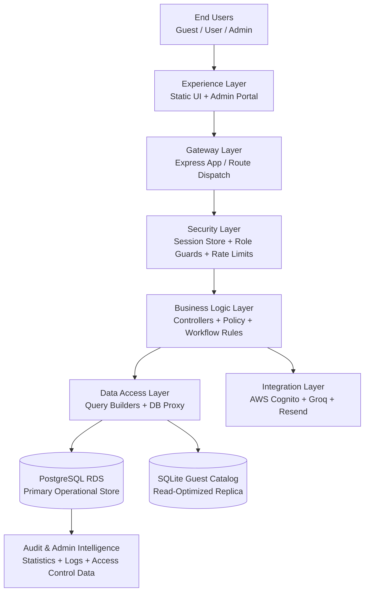

# ThrustVault

> Enterprise-grade propulsion intelligence platform for UAV motor selection, telemetry analysis, and secure role-based operations.

## Table of Contents
- [🎯 Project Overview](#-project-overview)
- [✨ Key Features](#-key-features)
- [🏗️ System Architecture](#️-system-architecture)
- [⚙️ Technology Stack](#️-technology-stack)
- [🧰 Configuration & Environment Variables](#-configuration--environment-variables)
- [🚀 Quick Start](#-quick-start)
- [🖥️ Usage Guide](#️-usage-guide)
- [🔌 API Reference](#-api-reference)
- [🗂️ Project Structure](#️-project-structure)
- [🧪 Testing](#-testing)
- [⚡ Performance](#-performance)
- [☁️ Cloud Deployment](#️-cloud-deployment)
- [🛡️ Security Policy](#️-security-policy)
- [🤝 Contributing](#-contributing)
- [📦 Release Notes](#-release-notes)
- [📄 License](#-license)
- [👥 Maintainers](#-maintainers)

---

## 🎯 Project Overview

### Mission
Deliver a trusted, data-rich UAV propulsion intelligence platform that enables engineering teams to select, validate, and operationalize motor configurations with confidence.

### Vision
Become the reference operational backbone for drone propulsion data workflows by unifying catalog intelligence, controlled access, analytics, and secure lifecycle governance.

### Problem Statement
UAV teams often operate with fragmented propulsion data, inconsistent test records, and weak access controls. ThrustVault addresses this with:
- unified motor and telemetry datasets,
- role-aware access paths for guest/user/admin personas,
- an auditable administration layer,
- deterministic data access APIs for both UI and automation use cases.

---

## ✨ Key Features

| Capability Domain | Feature | Description |
|---|---|---|
| Identity & Access | AWS Cognito authentication | Secure login, password reset, OTP verification, and role-aware session handling |
| Identity & Access | Role-based authorization | Guest, user, and admin roles enforced at route and data access layers |
| Data Platform | Motor catalog management | CRUD operations for motors, categories, and custom specs |
| Data Platform | Dynamic query proxy | PostgREST-style filtering via secure SQL query builder |
| Data Platform | SQLite guest catalog | Startup sync from PostgreSQL to SQLite for low-latency guest reads |
| Analytics | Performance analytics UI | Browser-based analytics and motor explorer experiences |
| Collaboration | Access request pipeline | Public request intake, admin review workflow, and approval controls |
| Admin Ops | Admin portal | User lifecycle ops, schema customization, imports/exports, and system insights |
| Security | Rate limiting | Request throttling for login, guest APIs, access request, and AI endpoints |
| AI Assist | Domain copilot API | Guardrailed UAV propulsion assistant integration via Groq chat completion |
| Governance | Audit logging | Activity tracking in PostgreSQL and SQLite (guest-safe logging path) |
| Notifications | Email integration | Transactional approval/rejection/credential messaging via Resend |

---

## 🏗️ System Architecture

### Layered Architecture (Detailed)



### Layer-by-Layer Responsibilities

1. **Experience Layer**
   - Serves customer-facing pages from `/public` and admin pages from `/admin_portal/public`.
   - Supports route rewrites and role-sensitive page routing (`/dashboard`, `/analytics`, `/explorer`, `/demo/*`).

2. **Gateway Layer**
   - Centralized Express route mounting through `/api/auth`, `/api/guest`, and `/api`.
   - Admin service exposes `/api/admin/*` domain endpoints.

3. **Security Layer**
   - Session management backed by PostgreSQL (`connect-pg-simple`).
   - Middleware enforcement via role checks (`requireRole`) and per-surface rate limits.
   - Admin portal middleware blocks non-admin access and stale sessions.

4. **Business Logic Layer**
   - Auth workflows (login/logout/session/forgot-password/reset-password).
   - Catalog and telemetry workflows for motors, categories, onboarding, and logs.
   - Admin workflows for user provisioning, account deletion, system settings, and analytics.

5. **Data Access Layer**
   - SQL-safe dynamic query composition (`queryBuilder`, `sqliteQueryBuilder`).
   - ACL-protected table proxy APIs.
   - Startup replication flow (`syncPostgresToSqlite`) for guest read plane.

6. **Data Layer**
   - **PostgreSQL (source of truth):** users, roles, motor data, test runs, audit logs, settings.
   - **SQLite (read replica for guests):** synchronized subset for high-speed anonymous access.

7. **Integration Layer**
   - **AWS Cognito:** authentication and user lifecycle.
   - **Groq API:** propulsion copilot responses.
   - **Resend:** lifecycle notifications and communication.

### Runtime Services
- **Primary API Service** (`server.js`, default port `8000`) — application frontend + API layer.
- **Admin Portal Service** (`admin_portal/server.js`, default port `8001`) — privileged operations console.

---

## ⚙️ Technology Stack

### Core Platform
- **Runtime:** Node.js (modern runtime, native fetch + node:sqlite APIs used)
- **Framework:** Express.js
- **Session Management:** express-session + connect-pg-simple

### Data & Persistence
- **Primary Database:** PostgreSQL (AWS RDS-oriented)
- **Read Replica for Guests:** SQLite (`database/guest_catalog.db`)

### Security & Identity
- **Identity Provider:** AWS Cognito
- **Auth Model:** Session-based auth + role normalization (`guest`, `user`, `admin`)
- **Traffic Controls:** express-rate-limit

### Integrations
- **AI Provider:** Groq chat completions API
- **Transactional Email:** Resend API

### Dependency Breakdown

**Root service (`package.json`)**
- `@aws-sdk/client-cognito-identity-provider`
- `connect-pg-simple`
- `dotenv`
- `express`
- `express-rate-limit`
- `express-session`
- `pg`
- dev: `sharp`

**Admin service (`admin_portal/package.json`)**
- `@aws-sdk/client-cognito-identity-provider`
- `connect-pg-simple`
- `dotenv`
- `express`
- `express-session`
- `pg`

---

## 🧰 Configuration & Environment Variables

### Required (Core)
- `PORT`, `ADMIN_PORT`
- `NODE_ENV`
- `SESSION_SECRET`
- `DB_HOST`, `DB_PORT`, `DB_USER`, `DB_PASSWORD`, `DB_NAME`

### AWS Cognito
- `COGNITO_REGION`
- `COGNITO_USER_POOL_ID`
- `COGNITO_CLIENT_ID`
- `COGNITO_CLIENT_SECRET`
- `AWS_ACCESS_KEY_ID` / `AWS_SECRET_ACCESS_KEY` (or profile-based non-prod credentials)

### Optional Integrations
- `GROQ_API_KEY`, `GROQ_MODEL`
- `RESEND_API_KEY`
- `APP_BASE_URL`

---

## 🚀 Quick Start

### Prerequisites
- Node.js 20+
- npm 10+
- PostgreSQL instance (local or managed)
- AWS Cognito app client and user pool

### 1) Install dependencies

```bash
cd /home/runner/work/ThrustVault/ThrustVault
npm install
cd /home/runner/work/ThrustVault/ThrustVault/admin_portal
npm install
```

### 2) Configure environment
Create `.env` files for both services with the variables listed above.

### 3) Start services

```bash
# Main service (port 8000 by default)
cd /home/runner/work/ThrustVault/ThrustVault
npm start

# Admin service (port 8001 by default)
cd /home/runner/work/ThrustVault/ThrustVault/admin_portal
npm start
```

### 4) First run behavior
On boot, the main service:
1. validates PostgreSQL connectivity,
2. applies startup migrations and schema adjustments,
3. synchronizes PostgreSQL operational data into SQLite guest catalog,
4. starts HTTP listener.

---

## 🖥️ Usage Guide

### Persona Flows

#### Guest User
1. Open `/demo/dashboard` or `/demo/analytics`.
2. Consume guest-safe catalog and telemetry via `/api/guest/*`.
3. Submit access requests through `/api/public/request-access`.

#### Authenticated User (user/admin)
1. Authenticate via `/login`.
2. Access `/dashboard`, `/analytics`, `/explorer`.
3. Manage catalog entities and test records through protected `/api/*` endpoints.

#### Administrator
1. Access admin portal at `/admin/*` via admin login.
2. Manage users, approvals, schema, imports/exports, audit logs, and system settings.
3. Execute controlled provisioning actions (`create_vault_user`, `delete_vault_user`).

### Operational Notes
- Session lifetime defaults to 24 hours.
- Role checks are enforced server-side on APIs and select script delivery paths.
- Guest traffic is sandboxed to SQLite-backed read APIs for resilience and safety.

---

## 🔌 API Reference

> Base URLs: main app (`:8000`), admin app (`:8001`).

### Authentication APIs (Main)
- `POST /api/auth/login`
- `POST /api/auth/logout`
- `GET /api/auth/session`
- `POST /api/auth/forgot-password`
- `POST /api/auth/verify-otp`
- `POST /api/auth/reset-password`

### Guest APIs
- `GET /api/guest/init-data`
- `GET /api/guest/categories`
- `GET /api/guest/motors`
- `GET /api/guest/custom-specs`
- `GET /api/guest/motor-test-runs`
- `GET /api/guest/motor-test-data-points`
- `POST /api/guest/log-activity`

### Core Data APIs (Role-Protected)
- `GET /api/init-data`
- `GET/POST /api/motors`
- `PATCH /api/motors/:id/recommendations`
- `GET/POST/DELETE /api/categories`
- `GET/POST/DELETE /api/custom-specs`
- `GET/POST /api/onboarding`
- `GET /api/user-profiles`
- `POST /api/log-activity`
- `ALL /api/db/:table` and `ALL /api/db/:table/:id`

### Public + AI APIs
- `POST /api/request-demo`
- `POST /api/public/request-access`
- `POST /api/ai/chat`

### Admin APIs (Representative)
- `GET/POST /api/admin/settings`
- `POST /api/admin/rpc/create_vault_user`
- `POST /api/admin/rpc/delete_vault_user`
- `GET /api/admin/statistics`
- `GET/POST /api/admin/onboarding`
- `PATCH /api/admin/users/:id`
- `GET /api/admin/users`
- `GET /api/audit-logs`
- `POST /api/log-activity`
- `POST /api/send-email`

---

## 🗂️ Project Structure

```text
/home/runner/work/ThrustVault/ThrustVault
├── server.js                  # Main service bootstrap and startup migrations
├── src/
│   ├── app.js                 # Express app wiring and route mounting
│   ├── config/                # PostgreSQL, SQLite, Cognito configuration
│   ├── controllers/           # Auth, guest, AI, and data business logic
│   ├── middlewares/           # Role guards and rate limiting
│   ├── routes/                # API route definitions
│   └── utils/                 # Query builders and SQLite synchronization
├── public/                    # Main UI static assets
├── database/                  # SQL schemas and migration scripts
├── admin_portal/
│   ├── server.js              # Admin portal backend
│   ├── src/                   # Admin shared config and utility modules
│   └── public/                # Admin frontend pages and scripts
├── render.yaml                # Main service deployment descriptor
└── admin_portal/render.yaml   # Admin service deployment descriptor
```

---

## 🧪 Testing

### Current State
The repository currently does **not** define automated `lint`, `test`, or `build` scripts in either service package.

### Available Commands
- Main service: `npm start`, `npm run dev`
- Admin service: `npm start`

### Recommended Test Strategy
1. **API contract tests** for auth, guest read APIs, and role-protected routes.
2. **Integration tests** for PostgreSQL + SQLite sync flow.
3. **Security regression tests** for authorization boundaries and rate limits.
4. **Admin workflow tests** for user provisioning/deprovisioning and settings changes.
5. **End-to-end smoke tests** for dashboard, analytics, and explorer flows.

---

## ⚡ Performance

### Existing Optimizations
- SQLite guest read plane to offload anonymous traffic from PostgreSQL.
- Parallelized bootstrap data fetch for initial catalog hydration.
- Dynamic query filtering with selective projection and pagination support.
- Endpoint-level rate limiting to protect critical surfaces.

### Operational Benchmark Framework (Recommended)
- **P50/P95/P99 latency** by endpoint category (`guest`, `auth`, `admin`).
- **Throughput under burst load** for guest APIs.
- **Startup sync duration** for PostgreSQL → SQLite.
- **Resource utilization** via `/api/admin/statistics`.

### Tuning Focus Areas
- Database indexing on frequently filtered columns.
- Query profiling on joined telemetry payload endpoints.
- Session table cleanup policy.
- SQLite refresh cadence and sync fault observability.

---

## ☁️ Cloud Deployment

### Current Deployment Blueprint
- Render deployment manifests are provided for:
  - main application (`/render.yaml`)
  - admin portal (`/admin_portal/render.yaml`)
- Production intent includes AWS RDS + AWS Cognito + optional Cloudflare edge hardening.

### AWS Guide (Reference Path)
1. Host Node services (ECS/Fargate, EC2, or managed PaaS).
2. Use RDS PostgreSQL as source of truth.
3. Configure Cognito User Pool + App Client.
4. Store secrets in AWS Secrets Manager / SSM.
5. Place CloudFront + WAF (or Cloudflare) in front for edge controls.

### GCP Guide (Reference Path)
1. Deploy services to Cloud Run.
2. Use Cloud SQL for PostgreSQL.
3. Use Identity Platform / external OIDC provider for auth compatibility.
4. Manage secrets with Secret Manager.
5. Use Cloud Armor for L7 protection.

### Azure Guide (Reference Path)
1. Deploy services to App Service / Container Apps.
2. Use Azure Database for PostgreSQL.
3. Use Azure AD B2C (or Cognito-compatible external pattern).
4. Manage secrets with Key Vault.
5. Protect with Front Door + WAF.

---

## 🛡️ Security Policy

For vulnerability handling and responsible disclosure:
1. Report issues privately to maintainers (do not open public exploit details).
2. Include reproduction details, affected surface, and impact statement.
3. Allow maintainers time for triage, patching, and coordinated disclosure.

Operational controls implemented include session protection, role guards, endpoint throttling, secure query construction, and edge hardening guidance (`SECURITY_DDoS_CLOUDFLARE_GUIDANCE.md`).

---

## 🤝 Contributing

1. Fork and create a focused feature branch.
2. Keep changes minimal and scoped.
3. Validate local startup for both services.
4. Document behavioral changes (API, schema, or environment).
5. Submit PR with rationale, risk assessment, and validation notes.

---

## 📦 Release Notes

### Versioning
- Current package version: `2.0.0` (main and admin service packages).
- Follow semantic versioning for future releases.

### Changelog Guidance
Capture for each release:
- added capabilities,
- changed behaviors,
- fixed defects,
- security updates,
- migration notes.

---

## 📄 License

This project is distributed under the **MIT License**.

> If you plan to publish externally, add a dedicated `LICENSE` file at the repository root for explicit legal distribution metadata.

---

## 👥 Maintainers

- **Core Team:** ThrustVault engineering maintainers
- **Repository Owner:** `@bharani-01`

For ownership updates, revise this section and release notes together to preserve governance clarity.

